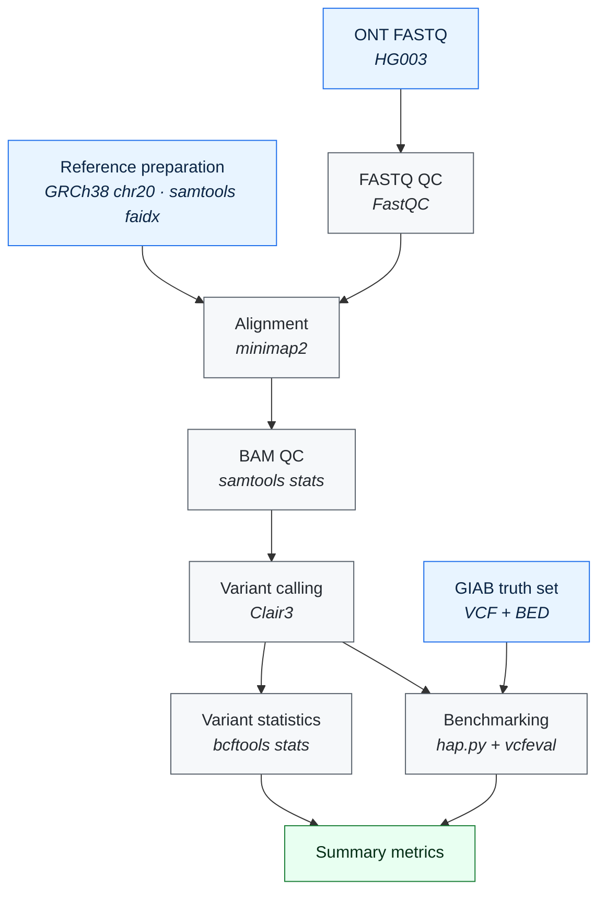

<div align="center">

# LongRead Variant Analysis
### Dr Suhirthakumar Puvanendran

### Reproducible Oxford Nanopore long-read variant calling and benchmarking with Nextflow

[](https://www.nextflow.io/)
[](https://nanoporetech.com/)
[](https://github.com/HKU-BAL/Clair3)
[](https://www.docker.com/)
[](https://www.python.org/)
[](https://www.nist.gov/programs-projects/genome-bottle)
[](LICENSE)

**FASTQ ➜ QC ➜ Alignment ➜ Variant calling ➜ Benchmarking**, in a single reproducible command.

</div>

---

A modular **Nextflow DSL2 workflow for Oxford Nanopore long-read variant analysis**, covering sequencing quality control, reference preparation, read alignment, BAM quality control, Clair3 variant calling, variant statistics and benchmarking against a GIAB HG003 truth set.

## Contents

- [Overview](#overview)
- [Pipeline at a glance](#pipeline-at-a-glance)
- [Workflow components](#workflow-components)
- [Quick start](#quick-start)
- [Requirements](#requirements)
- [Installation](#installation)
- [Running the pipeline](#running-the-pipeline)
- [Configuration](#configuration)
- [Repository structure](#repository-structure)
- [Outputs](#outputs)
- [Dataset](#dataset)
- [Benchmarking](#benchmarking)
- [Reproducibility](#reproducibility)
- [Project status](#project-status)
- [Roadmap](#roadmap)
- [Learning objectives](#learning-objectives)
- [Acknowledgements](#acknowledgements)
- [Author](#author)
- [Licence](#licence)

---

## Overview

Long-read sequencing offers an alternative to conventional short-read sequencing for identifying genomic variants, particularly in regions that are difficult to resolve with short reads.

This project demonstrates an end-to-end computational workflow for processing Oxford Nanopore sequencing data, calling small variants and evaluating them against a benchmark truth set.

The workflow is built around six principles:

| | |
|---|---|
| ♻️ **Reproducibility** | Identical results across compatible environments |
| 🧩 **Modularity** | One module per analytical stage |
| 📦 **Containerisation** | Docker images pinned per process |
| ⚙️ **Automation** | Nextflow handles scheduling, retries and caching |
| 📈 **Scalability** | Local, HPC or cloud executors |
| 🔍 **Transparent benchmarking** | Precision and recall against GIAB truth data |

The pipeline has been executed successfully from raw FASTQ input through to variant calling and benchmarking using a small chromosome 20 demonstration dataset.

---

## Pipeline at a glance



<details>
<summary>Prefer plain text? Click to expand the ASCII version</summary>

```text
                         LONG-READ VARIANT ANALYSIS
                                   │
                                   ▼
                         ┌───────────────────┐
                         │    ONT FASTQ      │
                         │      HG003        │
                         └─────────┬─────────┘
                                   ▼
                         ┌───────────────────┐
                         │     FASTQ QC      │
                         │      FastQC       │
                         └─────────┬─────────┘
                                   │
                 ┌─────────────────▼─────────────────┐
                 │       Reference preparation       │
                 │           GRCh38 chr20            │
                 └─────────────────┬─────────────────┘
                                   ▼
                         ┌───────────────────┐
                         │       ALIGN       │
                         │      minimap2     │
                         └─────────┬─────────┘
                                   ▼
                         ┌───────────────────┐
                         │      BAM QC       │
                         │   samtools stats  │
                         └─────────┬─────────┘
                                   ▼
                         ┌───────────────────┐
                         │      CLAIR3       │
                         │    Long-read      │
                         │  variant calling  │
                         └─────────┬─────────┘
                                   ▼
                         ┌───────────────────┐
                         │   Variant stats   │
                         │      bcftools     │
                         └─────────┬─────────┘
                                   ▼
                         ┌───────────────────┐
                         │     BENCHMARK     │
                         │  hap.py + vcfeval │
                         └─────────┬─────────┘
                                   ▼
                         ┌───────────────────┐
                         │ Benchmark results │
                         │ Precision, recall │
                         │     F1 score      │
                         └───────────────────┘
```

</details>

---

## Workflow components

| Stage | Tool | Module | Purpose |
|---|---|---|---|
| FASTQ QC | FastQC | `fastq_qc.nf` | Assess raw sequencing quality |
| Reference indexing | samtools | `reference.nf` | Prepare reference FASTA index |
| Alignment | minimap2 | `alignment.nf` | Align ONT reads to GRCh38 |
| BAM QC | samtools | `bam_qc.nf` | Assess alignment quality |
| Variant calling | Clair3 | `clair3.nf` | Identify small variants from long reads |
| Variant statistics | bcftools | `variant_stats.nf` | Summarise VCF variants |
| Benchmarking | hap.py, vcfeval | `benchmark.nf` | Compare calls against truth variants |
| Orchestration | Nextflow DSL2 | `main.nf` | Automate and reproduce the analysis |
| Environments | Docker | `nextflow.config` | Provide reproducible software stacks |

Each analytical stage is an independent DSL2 module, which makes components easier to test, maintain and reuse.

```text
main.nf
   ├── modules/fastq_qc.nf
   ├── modules/reference.nf
   ├── modules/alignment.nf
   ├── modules/bam_qc.nf
   ├── modules/clair3.nf
   ├── modules/variant_stats.nf
   └── modules/benchmark.nf
```

---

## Quick start

```bash
# 1. Clone
git clone https://github.com/Suhirthakumar/LongRead_VariantAnalysis.git
cd LongRead_VariantAnalysis

# 2. Validate the workflow structure without running the analysis
nextflow run main.nf -stub-run

# 3. Run the full demonstration pipeline
nextflow run main.nf
```

Results are written to `results/`. Interrupted runs can be continued with `-resume`.

---

## Requirements

| Requirement | Notes |
|---|---|
| Linux or WSL2 | Developed and tested on WSL2 |
| Nextflow | 25 or later recommended |
| Docker | Required for containerised processes |
| Java | 17 or later |
| Git | For cloning the repository |
| Internet access | For pulling containers and reference data |

Tested configuration:

```text
Nextflow 26.04.6
Docker
Java 17
WSL2
```

---

## Installation

<details open>
<summary><b>Step by step</b></summary>

**1. Clone the repository**

```bash
git clone https://github.com/Suhirthakumar/LongRead_VariantAnalysis.git
cd LongRead_VariantAnalysis
```

**2. Check Nextflow**

```bash
nextflow -version
```

**3. Check Docker**

```bash
docker --version
```

**4. Confirm Docker can run containers**

```bash
docker run hello-world
```

</details>

---

## Running the pipeline

| Command | What it does |
|---|---|
| `nextflow run main.nf -stub-run` | Validates workflow structure and channel connectivity without running the full analysis |
| `nextflow run main.nf` | Executes the complete pipeline |
| `nextflow run main.nf -resume` | Reuses cached results and restarts from the point of failure |
| `nextflow run main.nf --reads <path>` | Overrides a parameter at the command line |

> [!TIP]
> Run `-stub-run` first after any change to the modules. It catches wiring errors in seconds rather than after a long alignment step.

Nextflow caching means an interrupted analysis resumes without repeating completed processes:

```bash
nextflow run main.nf -resume
```

---

## Configuration

Pipeline parameters live in `nextflow.config`:

```groovy
params {
    reads      = 'data/raw/HG003_chr20.fastq.gz'
    reference  = 'data/reference/GRCh38_no_alt_chr20.fa'
    truth_vcf  = 'data/reference/HG003_GRCh38_chr20_v4.2.1_benchmark.vcf.gz'
    truth_bed  = 'data/reference/HG003_GRCh38_chr20_v4.2.1_benchmark_noinconsistent.bed'
    target_bed = 'data/reference/quick_demo.bed'
    sample     = 'HG003'
}
```

| Parameter | Description |
|---|---|
| `reads` | Input ONT FASTQ file |
| `reference` | Reference genome FASTA (GRCh38, chr20) |
| `truth_vcf` | GIAB benchmark variant set |
| `truth_bed` | GIAB high confidence regions |
| `target_bed` | Region restriction for the demonstration run |
| `sample` | Sample identifier used in output naming |

Any parameter can be overridden on the command line, for example:

```bash
nextflow run main.nf --sample HG004 --reads data/raw/HG004_chr20.fastq.gz
```

---

## Repository structure

```text
LongRead_VariantAnalysis/
│
├── main.nf                  # Workflow entry point
├── nextflow.config          # Parameters, profiles and container settings
├── README.md
├── .gitignore
│
├── modules/                 # DSL2 process modules
│   ├── fastq_qc.nf
│   ├── reference.nf
│   ├── alignment.nf
│   ├── bam_qc.nf
│   ├── clair3.nf
│   ├── variant_stats.nf
│   └── benchmark.nf
│
└── data/
    ├── raw/                 # Input FASTQ
    └── reference/           # Reference FASTA, truth VCF and BED files
```

Generated directories (`work/`, `.nextflow/`, `results/`) and large sequencing, BAM and VCF files are intentionally excluded from version control.

---

## Outputs

```text
results/
├── fastqc/          # Raw read quality reports
├── alignment/       # Sorted BAM and index
├── bam_qc/          # samtools stats summaries
├── variants/        # Clair3 VCF and index
├── stats/           # bcftools stats output
└── benchmark/       # hap.py summary and extended metrics
```

---

## Dataset

| Property | Value |
|---|---|
| Sample | **HG003** |
| Technology | Oxford Nanopore long-read sequencing |
| Reference | GRCh38, chromosome 20 |
| Demonstration region | `chr20:100000-300000` |
| Truth set | GIAB HG003 GRCh38 v4.2.1 benchmark |

Restricting the demonstration to a small genomic region keeps runtimes short while preserving the complete analytical structure of the workflow.

---

## Benchmarking

Variant calls are evaluated with `hap.py` using the `vcfeval` comparison engine against the GIAB truth set, restricted to high confidence regions.

Reported metrics:

- True positives, false positives and false negatives
- Precision
- Recall
- F1 score

### Demonstration results

Metrics from the chromosome 20 demonstration region:

| Variant type | TP | FP | FN | Precision | Recall | F1 |
|---|---|---|---|---|---|---|
| SNV | _to be added_ | | | | | |
| INDEL | _to be added_ | | | | | |

> [!NOTE]
> Figures from a 200 kb demonstration region are illustrative only and should not be read as genome-wide performance for Clair3 or for ONT sequencing generally.

---

## Reproducibility

The project separates the things that usually break reproducibility:

```text
Input data  ·  Pipeline logic  ·  Configuration  ·  Software environments  ·  Modules
```

| Mechanism | How it is applied |
|---|---|
| Nextflow DSL2 | Declarative workflow, explicit inputs and outputs |
| Docker containers | Pinned images per process |
| Version control | Code and configuration tracked in Git, large data excluded |
| Caching | `-resume` guarantees deterministic re-execution of incomplete work |
| Stub runs | Structure validated independently of the data |

Together these allow the same computational workflow to be reproduced across compatible environments.

---

## Project status

| Component | Status |
|---|---|
| Nextflow DSL2 workflow | ✅ Complete |
| Modular process architecture | ✅ Complete |
| Docker integration | ✅ Complete |
| FASTQ QC | ✅ Complete |
| Reference preparation | ✅ Complete |
| Read alignment | ✅ Complete |
| BAM QC | ✅ Complete |
| Clair3 variant calling | ✅ Complete |
| bcftools statistics | ✅ Complete |
| hap.py benchmarking | ✅ Complete |
| Workflow stub testing | ✅ Complete |
| Resume capability | ✅ Supported |
| Multi-sample support | 🔜 Planned |
| Whole-genome analysis | 🔜 Planned |

---

## Roadmap

<details>
<summary><b>Planned extensions</b></summary>

**Analysis**
- Multi-sample and whole-genome analysis
- Additional ONT datasets
- Structural variant calling
- Variant annotation and VEP integration

**Benchmarking**
- Multi-region benchmarking
- Multi-platform comparison
- Automated publication of benchmark reports

**Engineering**
- Automated MultiQC reporting
- Workflow testing with `nf-test`
- CI/CD workflow testing
- Cloud execution
- Seqera Platform integration

</details>

---

## Learning objectives

This project demonstrates practical experience in long-read sequencing analysis, Oxford Nanopore data processing, genome alignment, variant calling, BAM and VCF handling, variant benchmarking, Nextflow workflow development, Docker-based bioinformatics, reproducible computational research, and Linux and WSL2 environments.

It is also intended as a portfolio project for developing production-oriented bioinformatics workflow skills.

---

## Acknowledgements

This project builds on open-source software and publicly available genomic resources developed by the wider bioinformatics and genomics community:

[Nextflow](https://www.nextflow.io/) · [Oxford Nanopore Technologies](https://nanoporetech.com/) · [Clair3](https://github.com/HKU-BAL/Clair3) · [minimap2](https://github.com/lh3/minimap2) · [samtools](https://www.htslib.org/) · [bcftools](https://samtools.github.io/bcftools/) · [hap.py](https://github.com/Illumina/hap.py) · [Genome in a Bottle](https://www.nist.gov/programs-projects/genome-bottle) · [Docker](https://www.docker.com/)

### Citation

If you use this workflow in research or teaching, please cite the underlying software and reference datasets used in the analysis.

---

## Author

**Dr Suhirthakumar Puvanendran**
PhD Bioinformatics | Health Data Science | Clinical Research | AI in Healthcare

Research interests: bioinformatics, genomic data science, clinical research, healthcare AI, machine learning, multi-omics and reproducible computational research.

---

## Licence

Released under the MIT Licence. See [LICENSE](LICENSE) for the applicable terms.

<div align="center">

⭐ If you find this workflow useful, consider starring the repository.

</div>


